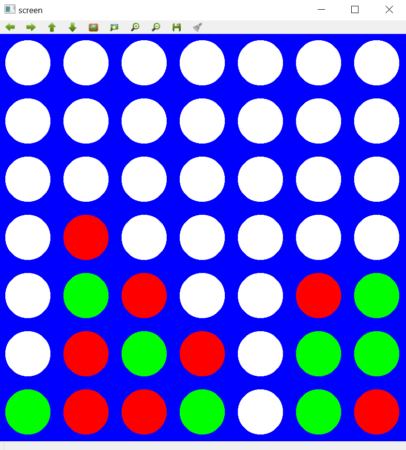

# Rainbow-Connect4

DQN & extensions applied to the game Connect4
based on the paper *Rainbow : Combining Improvements in Deep Reinforcement Learning*, DeepMind 


All the credits for the Rainbow part goes to this repository https://github.com/Kaixhin/Rainbow/. I only created a gym-like environment for a Connect4 game in order to replace Atari games originally used in the Rainbow article. A few modifications from the orginal github were needed though.

Using ```--render ``` flag during evaluation/training, one can see the agent (red) play against a simple AI (green).

<p align="center">

</p>

### Three essential ingredients : 

- An adaptive graphical interface that would imitate the screen of an Atari Games. It may seems like too much effort as, but instead of a simple array of 7x7, we created a 84x84 pixel image representing a given state within the game. The goal is to make the agent learn a policy out of a screenshot of the agent at each step of the game.

-  A (simple) AI that would play the role of the second player. Similarly to a Atari game like Pong for instance, the agent evolves in an environnent where he has to face another player. To this end, we defined a few simple rules to make the the opponent a bit harder to beat.

-  A Reward system. Several approaches can be debated but we choose the following one: 
     - +1 if the agent wins
     - -1 f the agent loses
     - -1 if the agent chooses a forbidden action
     - 0 otherwise
     
Rmk : the set of actions of the agents are {1,...,C} with C the number of columns. But once a column i has been completely filled, the action a=i becomes forbidden 

Results of our experiments over 500k iterations are in the folder results/500k Rainbow
